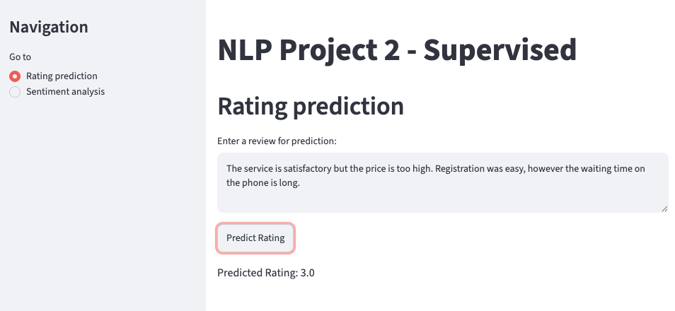
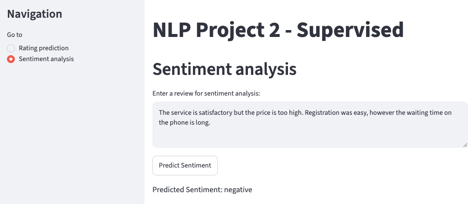

# Insurance Reviews — NLP Supervised Learning

Goal of the project: take ~34,000 real customer reviews of French insurance companies and build models that predict the star rating and the sentiment of a review, with a small web app on top.





## What I did

- **Data cleaning** — merged 35 Excel files, translated remaining French reviews to English, then lowercasing, punctuation/stopword removal, tokenization and POS-aware lemmatization (NLTK).
- **Exploration** — frequent words and bigrams, rating distribution, LDA topic modeling (the 5 topics map nicely to claims, customer service, billing, contracts and pricing).
- **Word embeddings** — trained a Word2Vec model (gensim), visualized it with PCA and TensorBoard, and used it for semantic search over the reviews.
- **Rating prediction** — TF-IDF + logistic regression, predicts 1–5 stars from the review text.
- **Sentiment analysis** — labeled the dataset with a zero-shot transformer, then trained a Keras model (embedding layer + pooling) on those labels.
- **Streamlit app** — enter a review, get a predicted rating and sentiment.

## Stack

Python, pandas, scikit-learn, NLTK, gensim, TensorFlow/Keras, Hugging Face transformers, Streamlit.

## Run it

```bash
pip install -r requirements.txt
streamlit run 7_streamlit_app.py
```

The full pipeline (cleaning → models → evaluation) is in `main.ipynb`.
 
---
**Live demo:** https://nlpsupervised0.streamlit.app/